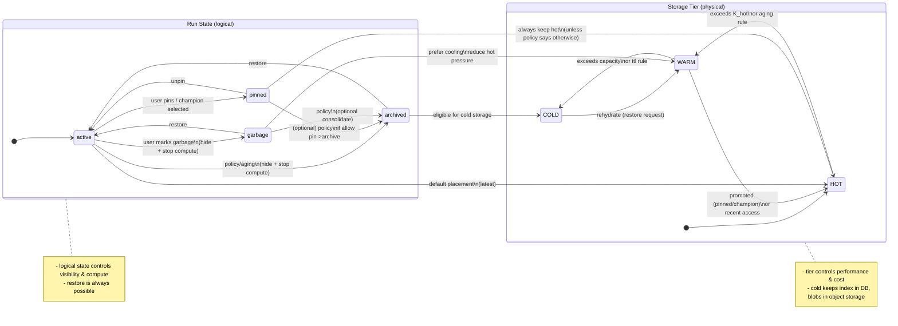

# Artifact-first Experiment Evaluation System: Spec Draft

## 1. 目的と背景

### 目的

* **成果物（artifact）を本質**として扱い、runの出来栄えを評価・比較し、洞察を得る。
* **品質指標（Run Metric）を後から育てる**（再計算可能であることが重要）。
* Langfuse等の観測基盤とは連携するが、**成果物中心の評価・比較・再計算**は本ツールの責務。

### 背景

* LLMやSAMの普及で「人の感覚でしか判断できない品質」を扱う場面が増える。
* 既存の実験管理はトレース中心/メトリクス中心になりがちで、**成果物の内容比較**や**後から評価指標を更新して再適用**する運用が弱い。

---

## 2. 概念モデル

## 2.1 用語

* **Run**

  * 1回の推論・評価の実行単位。
  * **複数のサンプル（case）をまとめて処理する集合**。
* **Case**

  * サンプル単位（あなたの「1行の予測」単位）。
  * ※UI/保存の優先度としては第2級だが、計算上は全数が必要になり得る。
* **OutputRow**

  * **中間出力/最終出力を区別せず**フラットに扱う出力行。
  * 中間/最終の意味付けは **ユーザー定義の列（スキーマ）**で表現する。
* **Artifact**

  * OutputRowが参照する成果物（JSON/Excel/text/image/HTML/binary等）。
  * 本質は内容物であり、比較・評価の主体。
* **Run Metric（品質指標）**

  * あなたの定義する「メトリック」：**ある1つのrunの出来栄えを評価する指標**。
  * 基本は run-level（第一級）。case-levelは第2級の扱い。
* **Comparison Indicator（比較指標）**

  * run同士の比較結果（例：差分、改善率など）。Run Metricとは別カテゴリ。
* **Health/Coverage Indicator（健全性指標）**

  * 評価の信頼性・偏り等（一般性の補助）。Run Metricとは別カテゴリ。

> 以降、「メトリック」という語は基本的に **Run Metric** を指す。

---

## 2.2 データモデル（論理）

### OutputRow（フラット出力行）

* **全ての出力はOutputRow**として同一モデルで扱う（最終出力を含む）。
* スキーマ（列定義）はユーザーが決める（ユーザー責務）。

#### 必須フィールド（システム）

* `run_id`
* `case_id`
* `output_id`
* `payload_ref`（artifact参照：URL/パス/オブジェクトキー等）
* `payload_hash`（内容ハッシュ）
* `created_at`

#### ユーザー定義フィールド（例）

* `stage`, `agent`, `component`, `step`, `is_final`, `parent_output_id`, `group_key` など

---

## 3. 設計方針（決め事）

## 3.1 出力のフラット化

* 中間/最終出力は区別しない。**すべてOutputRow**。
* “最終出力”の判定はシステム固定ではなく、ユーザー定義列（例：`is_final=true` or `stage="final"`）で表現。

## 3.2 case-levelの扱い（第2級）

* **保存・UI表示の優先度としてcase-levelは第2級**。
* ただし、run-levelのRun Metricを正しく算出するために、**計算上は全数走査が必要**なことがある。

## 3.3 D2: 増分更新・部分推論

* 部分推論・増分データ追加に対し、全数再計算を避けるため **DP（差分再計算）**を採用。
* アプローチ：

  * 変更が入ったcase（OutputRow）から下流の集計だけ更新する。
  * 実装上は「case寄与（contribution）」または「集計状態（state）」を保持して更新する。

### DPの対象（最小）

* run-levelのRun Metric（第一級）
* Health/Coverage（第一級の補助）
* Comparison Indicator（必要に応じて、runの比較が発生したときに計算）

## 3.4 Garbage runの扱い

* Garbage runは随時見えなくしてよい。
* Garbageは無限に増える前提で、**表示・計算の対象から外す**。
* ただし **復活可能**であること（論理削除）。

---

## 4. 指標カテゴリの分離（Builtin / User-defined）

## 4.1 Run Metric（run出来栄え：あなたのメトリック）

* Builtin / User-defined 両方あり得る。
* Builtinは「最低限の器と集計型（aggregation type）」を提供し、指標自体はユーザー実装が主になり得る。

## 4.2 Comparison Indicator（run比較）

* Builtin / User-defined 両方あり得る（差分や改善率などの型はBuiltinに向く）。

## 4.3 Health/Coverage（一般性・信頼性の補助）

* Builtinに共通の指標（件数、欠損、偏り、分布形状など）を置きやすい。
* User-definedで「代表性」の定義を拡張し得る。

---

## 5. 検索ユースケース（当該テーブル検索の観点）

> 目的：N+1を避け、Run/Artifact/Metricを一括で引ける設計にする

### Q1. 特定Artifactを1件取得（lookup）

* 入力：`artifact_id` または `payload_ref`
* 出力：artifactメタ + 参照 + プレビュー用情報

### Q2. Artifactの条件抽出

* 入力：type、run_id、期間、スキーマ、名前など
* 出力：artifact一覧 + 対応するrun/case/output

### Q3. case_id配下のOutputRow取得（drilldown）

* 入力：`case_id`（+ run条件）
* 出力：OutputRow一覧（+ artifact）

### Q4. run単位のOutputRow/Artifact取得（drilldown）

* 入力：`run_id`（+ stage/agent等）
* 出力：OutputRow一覧（+ artifact）

### Q5. Run Metricでrunを絞り、最終出力を開く

* 入力：`run_metric` のTopK/閾値
* 出力：run一覧 + **最終出力（final OutputRow）のartifactリンク**
* 重要：runごとの個別取得を避け、`run_id IN (...)`で一括取得

### Q6. 同一caseについて複数runの出力を横並び取得

* 入力：`case_id + run_id IN (...)`（+ ユーザー定義条件）
* 出力： (run_id, OutputRow, Artifact) の集合

### Q7. 2つのArtifactを比較するためにペアで取得（pair fetch）

* 入力：`artifact_id_a`, `artifact_id_b`
* 出力：2件のartifact（型情報含む）

### Q8. append-only前提の最新抽出（latest-by-key）

* 入力：ユーザー定義キー（例：`case_id + stage` 等）+ 最新条件
* 出力：最新版のOutputRow/Artifact

---

## 6. Run詳細ページの表示方針（Insight-first）

Runを開く目的は「成果物を見る」だけでなく、**洞察を得る**こと。

### Run詳細のコア問い（優先）

* このrunは**一般的な挙動**か？（偏りや外れ値で判断）
* 評価値（Run Metric）は**人の感覚**と相関しているか？（将来の指標育成）
* Championから**改善が見られる**か？（比較）

※表示がbusyなら段階化（サマリ→ドリルダウン）するが、最初のビューは洞察最短導線に寄せる。

---

## 7. ライフサイクルと物理配置（HOT/WARM/COLD）

### 7.1 Runの論理状態（復活可能）

* `active`：表示・計算対象
* `garbage`：非表示・計算対象外（復活可能）
* `archived`：非表示・原則計算対象外（復活可能）
* `pinned`：champion/ユーザー固定（常にホット扱いが基本）

### 7.2 物理配置（Storage Tier）

* **HOT（latest）**：直近・参照頻度高、UIの既定対象
* **WARM**：DB内に保持するが通常は表示しない（必要時に検索）
* **COLD（Object Storage）**：実体は退避、DBにはインデックス/メタのみ保持

### 7.3 移送ポリシー（例）

* `HOT`：直近K件 + pinned + champion + 比較セット参照
* K超過分は `WARM` へ移送（特にgarbage優先で落とす）
* `WARM` が閾値超過 or 一定期間経過で `COLD` へ退避

### 7.4 DPとの整合

* HOT/WARMにはDP用の集計状態（run-level指標）を保持して更新可能にする。
* COLDは原則更新しない。復活（rehydrate）時に戻す／再構築する。

---

# Mermaid: Run State × Storage Tier Transition

