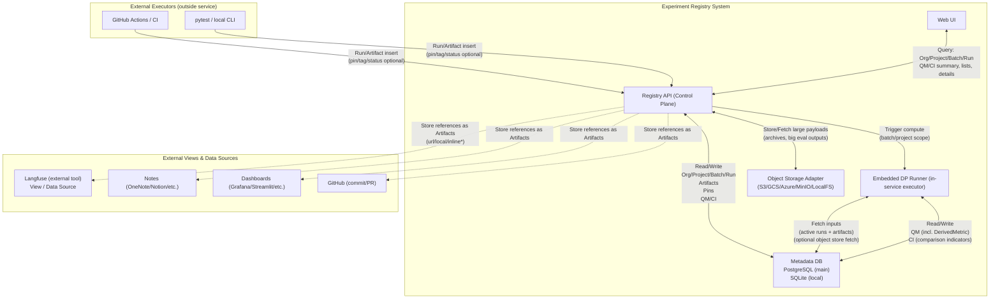

# システム構成 概要

## 目的

実験の成果物・ログ・ノートなどが分散して「どこに何があるか分からない」問題を解消するために、実験単位（Batch/Run）でURL/参照を集約し、UIで一覧・検索・比較できるようにする。

### 主目的
- リンクの集約と整理（garbage/activeの仕分け、重要runの固定表示）
- DP（集計）で導出できる指標を高速に計算し、表示に反映する

### 非目的（v0.1ではやらない）
- 解析アルゴリズムの自動最適化
- 本格的なノートエディタ（OneNote等の代替）
- Langfuse UIそのものの置換（統合対象ではなく外部View/DataSource）

## 前提（確定事項）

| 項目           | 内容                                                              |
| -------------- | ----------------------------------------------------------------- |
| 管理階層       | Org > Project > Batch > Run                                       |
| 外部ツール     | Langfuse等は統合対象ではなく "Data Source / View の一つ"          |
| DB             | 本番/標準は PostgreSQL、ローカルは SQLite（ただしPostgreSQLが主） |
| Object Storage | プロバイダ差し替え可能（S3/GCS/Azure Blob/MinIO/ローカル等）      |

## コンポーネント構成図

## コンポーネント責務

### Registry API（Control Plane）
- Org/Project/Batch/Run CRUD
- Artifact CRUD（＝Signal受け口）
- pin（champion / user_selected）管理
- DPトリガー受付
- UI向け集約API（固定＋recent折りたたみ）

### Embedded DP Runner（API内蔵）
- 入力：DB上の Run + Artifact（必要ならObject Storage参照）
- 出力：
  - DerivedMetric（QM） テーブルへ upsert
  - ComparisonIndicator（CI） テーブルへ upsert

### DB
- PostgreSQL（メイン）
- SQLite（ローカル開発用：同じスキーマで動く）

### Object Storage Abstraction
- ObjectStore インタフェースを定義して差し替え可能にする
- 実装：S3/GCS/Azure Blob/MinIO/Local FS…
- 使いどころ
  - 大きい評価結果、ログ、アーカイブ
  - DP入力の大きな中間データ

## 実行者（Runner）の2系統分離

### Artifact Ingest Runner（外部実行：pytest/CI）
| 項目     | 内容                                                       |
| -------- | ---------------------------------------------------------- |
| 役割     | Run作成、Artifact追加、タグ/ステータス更新、pin操作など    |
| 実行環境 | pytest / GitHub Actions / 手元CLI                          |
| 成果     | Registry APIへ Run/Artifact を登録するだけ（計算はしない） |

### Embedded DP Runner（内蔵：サービス側）
| 項目     | 内容                                                                                                                  |
| -------- | --------------------------------------------------------------------------------------------------------------------- |
| 役割     | DerivedMetric(QM) と ComparisonIndicator(CI) の計算、case-level全数計算（第2級）のDP含む、garbage除外などのルール適用 |
| 実行環境 | APIサービス内で動く埋め込みランナー                                                                                   |
| 方式     | 同期実行（小規模向け）または非同期実行（推奨）                                                                        |

> **ポイント**
> - 「スケジューリングを自前で持たない」＝OK
> - 「計算の実行器（embedded runner）はサービス側に必要」＝OK
