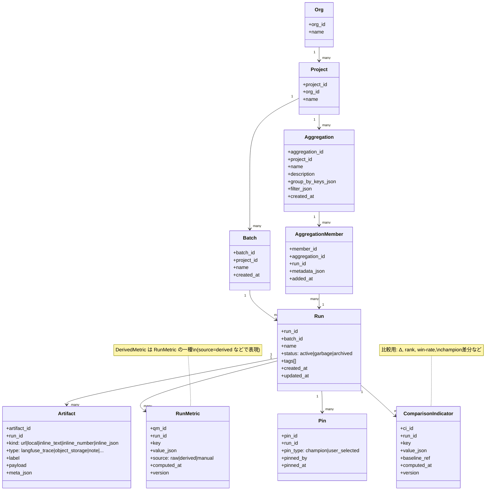

# データモデル

## 管理階層（Org > Project > Batch > Run）



## 用語の正規化

### Run Metric（RM）と Comparison Indicator（CI）

| 区分                           | 説明                                | 例                                                                                                        |
| ------------------------------ | ----------------------------------- | --------------------------------------------------------------------------------------------------------- |
| **Run Metric（RM）**           | 「そのRunがどれだけ良いか」を表す値 | Accuracy、F1、BLEU、Aesthetic score、コスト、レイテンシ                                                   |
| **Comparison Indicator（CI）** | 「Run同士を比較するための指標」     | Championとの差分（Δ）、ランキング（順位、percentile）、勝率 / ペアワイズ勝ち負け、改善率（relative lift） |

> **重要**: DerivedMetric は Run Metric の一種（＝計算で導出されたRM）  
> CIはRMから導かれることが多いが、同一ではない

**仕様として**: UIは "RM" を基本表示軸にし、CIは "比較ビュー/補助情報" として扱う（同じテーブル/キー空間に混ぜない）

### Artifact（参照＋小さい値）

Artifact は「リンク」ではなく "参照 or 小さい値" を保持する汎用コンテナ。

```
Artifact = {kind, type, label, payload, meta}
```

| フィールド | 値                                                                                             |
| ---------- | ---------------------------------------------------------------------------------------------- |
| `kind`     | `url` \| `local` \| `inline_text` \| `inline_number` \| `inline_json`                          |
| `type`     | `langfuse_trace` \| `object_storage` \| `note` \| `dashboard` \| `git_commit` \| `file` \| ... |
| `payload`  | kindに応じた値                                                                                 |
| `meta`     | `trace_id` / `bucket` / `path` / `mime` / `schema_version` など                                |

## データ種別の責務分担

### Artifact（参照＋小さい値）

| kind            | payload                                                        |
| --------------- | -------------------------------------------------------------- |
| `url`           | `"https://..."` / `"s3://..."` など                            |
| `local`         | `"/mnt/data/..."` など（相対パスも許可するなら基準点をmetaで） |
| `inline_text`   | `"best run"` みたいな短文                                      |
| `inline_number` | `0.913`                                                        |
| `inline_json`   | `{...}`                                                        |

### Run Metric（RM）

| フィールド               | 説明                                                                  |
| ------------------------ | --------------------------------------------------------------------- |
| `run_id`                 | 対象Run                                                               |
| `key`                    | 例：`accuracy`, `f1_macro`, `latency_p95_ms`                          |
| `value_json`             | 数値/構造体OK                                                         |
| `source`                 | `derived` / `raw` / `manual` など（DerivedMetricは `source=derived`） |
| `computed_at`, `version` | タイムスタンプとバージョン                                            |

### Comparison Indicator（CI）

| フィールド               | 説明                                                       |
| ------------------------ | ---------------------------------------------------------- |
| `run_id`                 | 対象Run                                                    |
| `key`                    | 例：`delta_vs_champion_f1`, `rank_overall`, `is_candidate` |
| `value_json`             | 値                                                         |
| `baseline_ref`           | championのrun_idや比較対象をmetaに                         |
| `computed_at`, `version` | タイムスタンプとバージョン                                 |

> **QMとCIは"テーブル分離"を仕様として固定（混ぜない）**  
> UIが混乱しなくなります。
