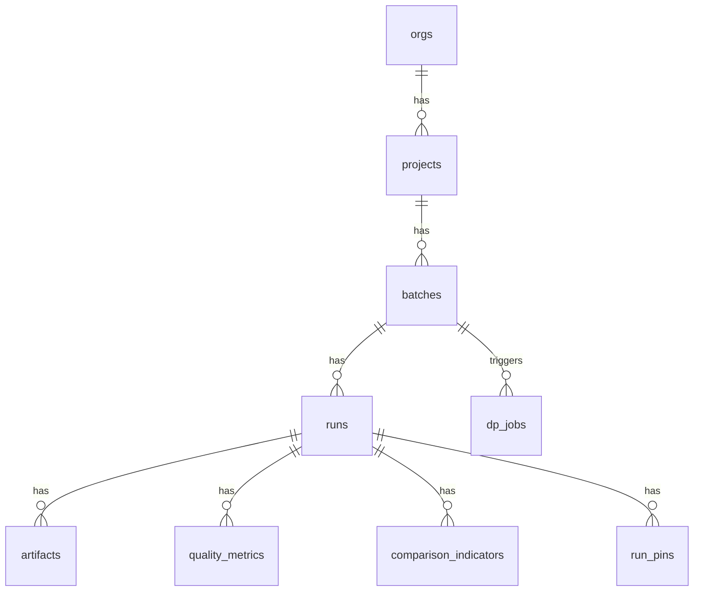

# DB物理スキーマ（PostgreSQL主 / SQLite互換）

## 方針

- SQLite互換を優先し、型は "現実的に共通化"
- UUID は文字列（TEXT）で持てるようにする
- JSON は
  - PostgreSQL：`jsonb`
  - SQLite：`TEXT`（JSON文字列）
- インデックスはPostgreSQLで本気、SQLiteは必要最低限

---

## テーブル定義

### orgs

| Column       | Type      | Constraints |
| ------------ | --------- | ----------- |
| `org_id`     | TEXT      | PRIMARY KEY |
| `name`       | TEXT      | NOT NULL    |
| `created_at` | TIMESTAMP | NOT NULL    |

### projects

| Column       | Type      | Constraints |
| ------------ | --------- | ----------- |
| `project_id` | TEXT      | PRIMARY KEY |
| `org_id`     | TEXT      | NOT NULL    |
| `name`       | TEXT      | NOT NULL    |
| `created_at` | TIMESTAMP | NOT NULL    |

**Index:**
- `(org_id, created_at DESC)`

### batches

| Column       | Type      | Constraints |
| ------------ | --------- | ----------- |
| `batch_id`   | TEXT      | PRIMARY KEY |
| `project_id` | TEXT      | NOT NULL    |
| `name`       | TEXT      | NOT NULL    |
| `created_at` | TIMESTAMP | NOT NULL    |

**Index:**
- `(project_id, created_at DESC)`

### runs

| Column       | Type      | Constraints                                    |
| ------------ | --------- | ---------------------------------------------- |
| `run_id`     | TEXT      | PRIMARY KEY                                    |
| `batch_id`   | TEXT      | NOT NULL                                       |
| `name`       | TEXT      | NOT NULL                                       |
| `status`     | TEXT      | NOT NULL (`active` \| `garbage` \| `archived`) |
| `tags_json`  | TEXT      | NOT NULL (JSON array string)                   |
| `note`       | TEXT      | short optional                                 |
| `created_at` | TIMESTAMP | NOT NULL                                       |
| `updated_at` | TIMESTAMP | NOT NULL                                       |

**Index:**
- `(batch_id, created_at DESC)`
- `(batch_id, status, created_at DESC)`

### run_pins

| Column      | Type      | Constraints                              |
| ----------- | --------- | ---------------------------------------- |
| `pin_id`    | TEXT      | PRIMARY KEY                              |
| `run_id`    | TEXT      | NOT NULL                                 |
| `batch_id`  | TEXT      | NOT NULL                                 |
| `pin_type`  | TEXT      | NOT NULL (`champion` \| `user_selected`) |
| `pinned_by` | TEXT      |                                          |
| `pinned_at` | TIMESTAMP | NOT NULL                                 |

**Constraints (logical):**
- champion uniqueness: `(batch_id, pin_type='champion')` は最大1
  - PostgreSQL：partial unique index
  - SQLite：アプリ側で担保（v0.1）

**Index:**
- `(batch_id, pin_type, pinned_at DESC)`

### artifacts

| Column           | Type      | Constraints                                                                      |
| ---------------- | --------- | -------------------------------------------------------------------------------- |
| `artifact_id`    | TEXT      | PRIMARY KEY                                                                      |
| `run_id`         | TEXT      | NOT NULL                                                                         |
| `kind`           | TEXT      | NOT NULL (`url` \| `local` \| `inline_text` \| `inline_number` \| `inline_json`) |
| `type`           | TEXT      | NOT NULL                                                                         |
| `label`          | TEXT      | NOT NULL                                                                         |
| `payload_text`   | TEXT      | url/local/text/json-string                                                       |
| `payload_number` | REAL      | inline_number                                                                    |
| `meta_json`      | TEXT      | NOT NULL                                                                         |
| `created_at`     | TIMESTAMP | NOT NULL                                                                         |

> **Note:** kindごとに使うpayload列が違う（どれか1つが埋まる）

**Index:**
- `(run_id, created_at DESC)`
- `(type, created_at DESC)`（必要なら）

### quality_metrics

| Column        | Type      | Constraints                               |
| ------------- | --------- | ----------------------------------------- |
| `qm_id`       | TEXT      | PRIMARY KEY                               |
| `run_id`      | TEXT      | NOT NULL                                  |
| `key`         | TEXT      | NOT NULL                                  |
| `value_json`  | TEXT      | NOT NULL (number or json string)          |
| `source`      | TEXT      | NOT NULL (`raw` \| `derived` \| `manual`) |
| `computed_at` | TIMESTAMP | NOT NULL                                  |
| `version`     | INTEGER   | NOT NULL                                  |

**Unique:**
- `(run_id, key, version)` または v0.1は `(run_id, key)` に最新上書きでもOK

**Index:**
- `(run_id, computed_at DESC)`

### comparison_indicators

| Column         | Type      | Constraints             |
| -------------- | --------- | ----------------------- |
| `ci_id`        | TEXT      | PRIMARY KEY             |
| `run_id`       | TEXT      | NOT NULL                |
| `key`          | TEXT      | NOT NULL                |
| `value_json`   | TEXT      | NOT NULL                |
| `baseline_ref` | TEXT      | run_id of champion etc. |
| `computed_at`  | TIMESTAMP | NOT NULL                |
| `version`      | INTEGER   | NOT NULL                |

**Index:**
- `(run_id, computed_at DESC)`

### dp_jobs

| Column         | Type      | Constraints                                                               |
| -------------- | --------- | ------------------------------------------------------------------------- |
| `job_id`       | TEXT      | PRIMARY KEY                                                               |
| `batch_id`     | TEXT      | NOT NULL                                                                  |
| `mode`         | TEXT      | NOT NULL (`active_only` \| `include_garbage`)                             |
| `recompute`    | INTEGER   | NOT NULL (0/1)                                                            |
| `status`       | TEXT      | NOT NULL (`queued` \| `running` \| `succeeded` \| `failed` \| `canceled`) |
| `requested_by` | TEXT      |                                                                           |
| `created_at`   | TIMESTAMP | NOT NULL                                                                  |
| `started_at`   | TIMESTAMP |                                                                           |
| `finished_at`  | TIMESTAMP |                                                                           |
| `error_text`   | TEXT      |                                                                           |

**Index:**
- `(batch_id, created_at DESC)`
- `(status, created_at DESC)`

---

## ER図（概念）

