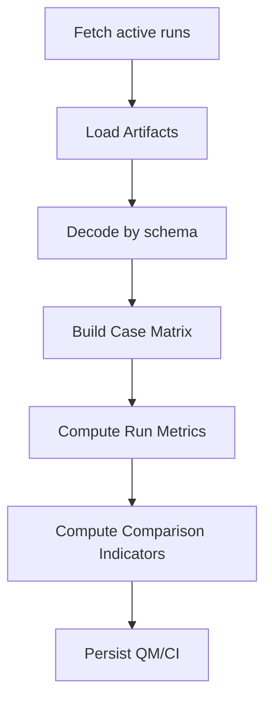

# DP Runner 仕様

## 責務

DP Runner は**埋め込み実行器**であり、以下を唯一の仕事とする：

> Artifact（評価結果・ログ・参照）から  
> **Run Metric（RM）** と **Comparison Indicator（CI）** を計算し  
> Registry DB に保存する

外部ツール（Langfuse等）を直接使っても良いが、原則の一次入力は Artifact。

---

## 入力の正規形（Artifact Schema）

DP Runner が解釈すべき "評価入力" は、以下のどれかで Run に紐づく：

### A. inline_json

```json
{
  "kind": "inline_json",
  "type": "evaluation",
  "label": "case_scores",
  "payload": {
    "schema": "case_score_v1",
    "cases": [
      {"case_id": "c1", "score": 0.91},
      {"case_id": "c2", "score": 0.84}
    ]
  }
}
```

### B. object_storage（大規模データ）

```json
{
  "kind": "url",
  "type": "object_storage",
  "label": "eval_json",
  "payload": "s3://bucket/batch123/run456/eval.json",
  "meta": { "schema": "case_score_v1" }
}
```

### C. langfuse_trace（参照）

```json
{
  "kind": "url",
  "type": "langfuse_trace",
  "label": "trace",
  "payload": "https://langfuse/.../trace/abc",
  "meta": { "trace_id": "abc", "schema": "langfuse_v1" }
}
```

> **重要**: DP Runner は `meta.schema` によってデコーダを切り替える。  
> スキーマ不明＝無視 or job失敗（v0.1では無視でOK）

---

## 内部パイプライン



### 各段階の詳細

#### 1) Fetch active runs
- 対象：batch内の `status=active`
- garbageは除外（`mode=include_garbage` で上書き可）

#### 2) Load Artifacts
- `type in (evaluation, object_storage, langfuse_trace)`
- `kind=inline_json` → 直接読む
- `kind=url + object_storage` → ObjectStore.get
- `kind=url + langfuse` → HTTP fetch（失敗してもDPは続行可）

#### 3) Decode by schema
`meta.schema` によって JSON を正規形に変換：

```python
# 正規形（内部）
CaseScores = {
  run_id: {
    case_id: float_score
  }
}
```

#### 4) Build Case Matrix（Case-level DPの基礎）

```python
Cases = union of all case_id across runs
Matrix[c][r] = score of run r on case c (NaN if missing)
```

> ここが**第2級（Case-level）DP**の入口  
> 「全件計算しないと意味が出ない」構造を明示的に作る

---

## Run Metric（RM）の計算

RM は Run単位で得られる"質"。

### Run-level（第1級）

caseを見ない。

| 例              | 説明         |
| --------------- | ------------ |
| `latency_p95`   | レイテンシ   |
| `cost_usd`      | コスト       |
| `model_size_mb` | モデルサイズ |

**Artifact例：**
```json
{
  "kind": "inline_number",
  "type": "latency_p95_ms",
  "label": "p95",
  "payload": 312
}
```

→ QM に直接コピー（`source=raw`）

### Case-level（第2級）Derived Metrics

Case Matrix から計算されるQM（= DerivedMetric）

| 例                     | 説明                     |
| ---------------------- | ------------------------ |
| `mean_score`           | 平均スコア               |
| `median_score`         | 中央値                   |
| `win_rate_vs_baseline` | ベースライン比勝率       |
| `failure_rate`         | score < threshold の割合 |

**例（mean_score）：**

$$QM_{mean}(run_r) = \frac{1}{|Cases|} \sum_c Matrix[c][r]$$

DP Runnerはこれを以下の形式で保存：

```json
{
  "run_id": "r1",
  "key": "mean_case_score",
  "value_json": 0.873,
  "source": "derived"
}
```

---

## Comparison Indicator（CI）の計算

CIは Runを比較するための派生指標。  
QMから導くが **QMとは別物** として保存。

### Champion基準

champion run = Pin(`pin_type=champion`)

#### delta_vs_champion_mean_score

$$CI_{delta}(r) = QM_{mean}(r) - QM_{mean}(champion)$$

#### win_rate_vs_champion

$$CI_{winrate}(r) = \frac{|c \mid Matrix[c][r] > Matrix[c][champion]|}{|Cases|}$$

### Ranking系

$$CI_{rank}(r) = rank\ of\ QM_{mean}(r)\ descending$$

### 判定系（ルール）

```python
CI_is_candidate = (CI_rank <= 3) AND (CI_delta > -0.01)
```

> こうした boolean も CI（QMではない）

---

## 欠損とNaNの扱い

Case-level DPでは欠損が必ず出る。

### ルール（v0.1）

**caseが欠けているrun：**
- `Matrix[c][r] = NaN`

**QM計算：**
- mean系 → NaNは無視（分母は "存在するケース数"）
- win_rate → 両方NaNならそのcaseは比較対象外

**CI計算：**
- 比較不能 → CIは `null` として保存
- `null` は UIで "N/A" 表示（0や空欄にしない）

---

## 出力契約

DP Runnerは**必ず2種類のテーブルに書く**

| 種類                       | 保存先                  |
| -------------------------- | ----------------------- |
| Run Metric（RM）           | `run_metrics`           |
| Comparison Indicator（CI） | `comparison_indicators` |

- DerivedMetric = RM where `source="derived"`
- CI は RM とは混ぜない（キー空間も分離）

---

## 実装上の最低要件

DP Runner が守ること：

1. **Case Matrix を必ず構築**（第2級DPの保証）
2. **garbage をデフォルトで除外**
3. **champion が無い場合**
   - `CI_delta`, `CI_winrate` は `null`
   - rank は QM のみで計算
4. **失敗しても**
   - QMとCIは部分的にでも upsert しない（v0.1は atomic）

---

## テスト容易性（pytest前提）

pytestから：

1. Run + Artifact（inline_json）を登録
2. `POST /dp/compute`
3. `GET /run-metrics`
4. `GET /comparison-indicators`
5. 値を assert

→ DPの正当性をCIで保証できる構成
