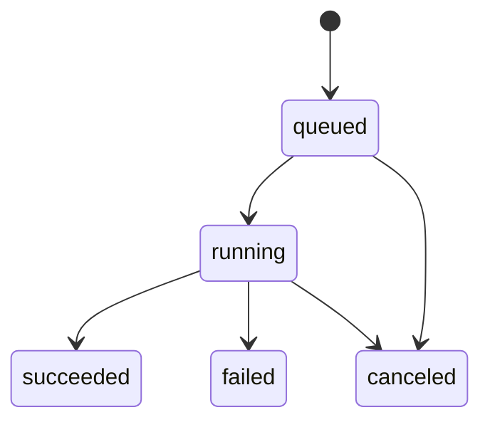
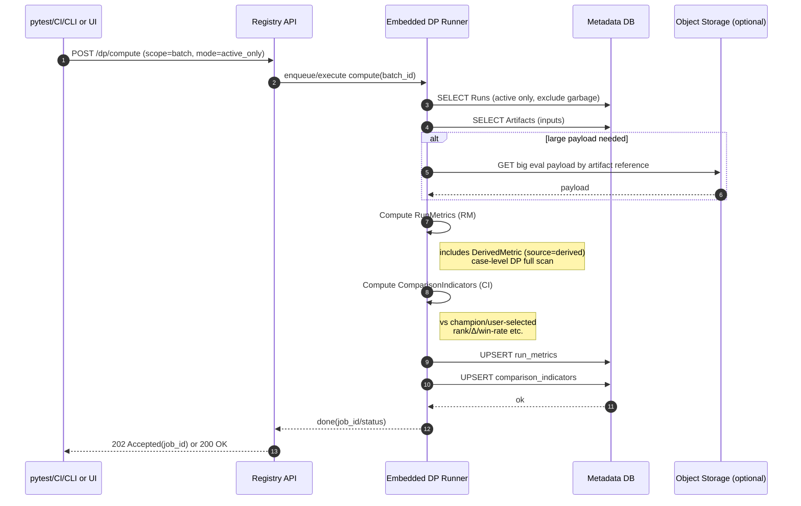

# DPジョブ状態モデル

## 状態一覧

| 状態        | 説明                             |
| ----------- | -------------------------------- |
| `queued`    | 要求受付済み、まだ実行していない |
| `running`   | Embedded DP Runnerが計算中       |
| `succeeded` | 完了（QM/CIがDBに反映済み）      |
| `failed`    | 失敗（error_textに理由）         |
| `canceled`  | キャンセル（v0.1は未実装でもOK） |

---

## 状態遷移図



---

## 実行ポリシー（v0.1推奨）

### 同一batchの同時実行

- 同一batchで `running` がある場合
  - `recompute=true` でも後続は `queued` に積む（直列）

### 成果

- `run_metrics` と `comparison_indicators` を upsert（最新上書き）
- version を上げる運用は v0.2（まずは上書きでOK）

---

## 失敗時の扱い

- `failed` の job を残す（原因追跡）
- 部分成功があり得るなら
  - "書き込みは最後にまとめて" か
  - "キー単位でupsertして失敗箇所をjobに記録"
- v0.1は前者（アトミック寄り）がおすすめ

---

## 再実行（recompute）

`recompute=true` の場合：QM/CIを再計算し、最新上書き（v0.1）

### 何が変わるか

- Artifactが追加された
- championが変わった
- DPロジックのversionが上がった

> v0.2で version を活かして履歴保持  
> v0.1は "最新のみ保持" で運用を軽くする

---

## 冪等性（重要）

DP Runner は：
- **入力**（Artifact集合 + champion/user_selected状態 + DP version）が同じなら
- **出力**（QM/CI）が同じになる

→ `dp_jobs` に `input_fingerprint`（hash）を入れるのが理想（v0.2）  
→ v0.1では job単位のログだけでも可

---

## APIフロー

### 起動

```
POST /v1/batches/{batchId}/dp/compute
```

**Request**
```json
{
  "mode": "active_only",
  "recompute": true
}
```

**Response**
```json
{
  "jobId": "job_01H...",
  "status": "queued"
}
```

### 状態取得

```
GET /v1/dp/jobs/{jobId}
```

**Response**
```json
{
  "jobId": "job_01H...",
  "batchId": "batch_xyz",
  "mode": "active_only",
  "status": "succeeded",
  "createdAt": "2026-02-03T10:00:00Z",
  "startedAt": "2026-02-03T10:00:01Z",
  "finishedAt": "2026-02-03T10:00:15Z",
  "errorText": null
}
```

---

## シーケンス図


