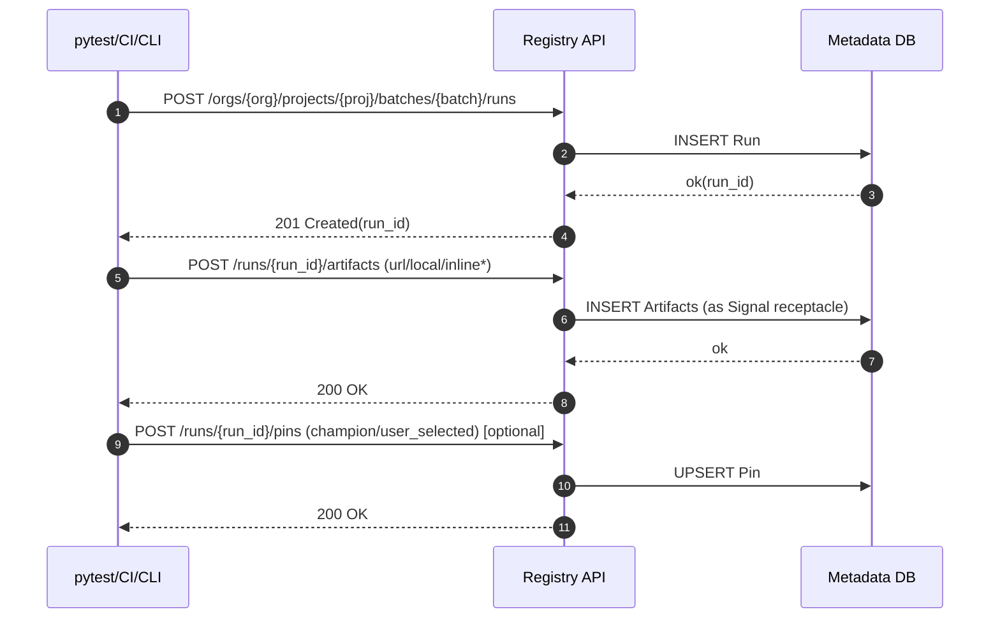
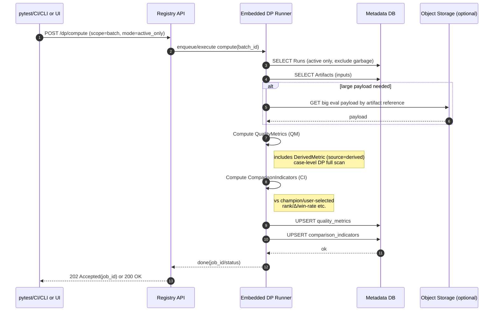
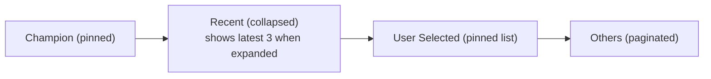
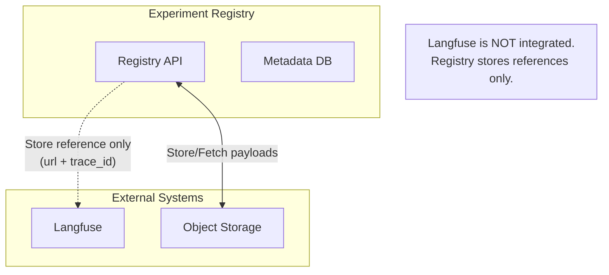

# データフローとシーケンス図

## Artifact挿入（pytest/CI側）

---

## DPトリガー（外部から叩くが、計算は内蔵Runner）

---

## UIの「Champion / Recent(3) / User Selected」配置

### UIに直結する「固定＋折りたたみ」設計

**要件：**
- **固定枠：** Champion、User Selected
- **折りたたみ枠：** ChampionとUser Selectedの "間" に Recent（直近3）

**Recent の条件：**
- `status=active` かつ（pinでない）
- 直近 `created_at` 上位3（などルール化）

**表示の基本：**
- **QM：** 常に見せる（主表示）
- **CI：** 補助（比較のときに見せる、または小さく表示）

---

## 外部参照（Langfuse等）の扱い

- Registry は Langfuseのデータを持たない（必要なら "参照情報" だけArtifactに保存）
- DP Runner が必要に応じて Langfuse API を読むのはあり（ただし認証/レートが課題なので v0.1 は "URL + trace_id を保存" が無難）

